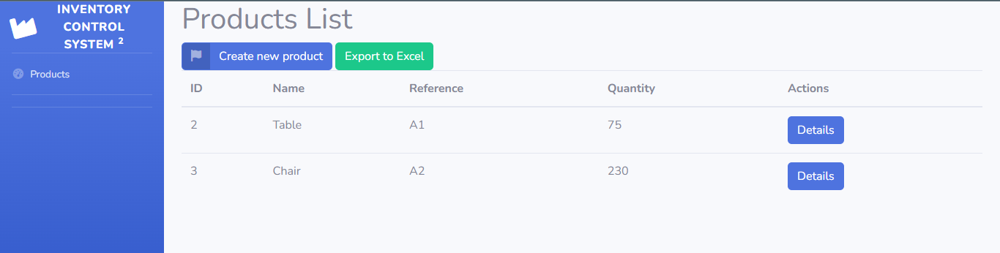

# Project Name: Ruby on Rails Inventory Control App

## Project description:
The app is an inventory control system. It lets the user perform CRUD operations on products and product movements.
The user can also download Excel files containing the inventory of all products and the details for a specific product and its movements.

## Project Requirements:
The project has been built according to the specifications included in the following links:

https://github.com/damuz91/mi-bodega-rails

https://www.youtube.com/watch?v=JG0C2rtpCvI

## Getting Started

To get a local copy of this project clone this repository: git clone https://github.com/DarioAlessioR/warehouse-rails

In the root directory run: `gem install bundler`

Then run: `bundle install`

Then run: `rails db:migrate`

Run app in the Command Line: `rails s`

To run test cases in the command line type: `rspec spec`

## Built With:
Major languages: `HTML`, `JavaScript`, `Ruby`, `Postgresql`, `Ruby on Rails`

Technologies used: `VSC`, `Github`, `Gitflow`, `Bootstrap`, `RSpec`, `Capybara`

##  Author
👤 Dario Alessio

- GitHub: https://github.com/DarioAlessioR

- Slack: https://microverse-students.slack.com/team/U039GCFRK9B

- LinkedIn: https://www.linkedin.com/in/dario-alessio-3a3b7911b

## 🤝 Contributing:

Contributions, issues, and feature requests are welcome!

Feel free to check the [issues page](../../issues/).

## Show your support:

Give a ⭐️ if you like this project!

## Acknowledgments

- Hat tip to David Munoz (https://github.com/damuz91) for creating the original repo and Youtube video
- Inspiration
- etc

## 📝 License

This project is [MIT](LICENSE) licensed.